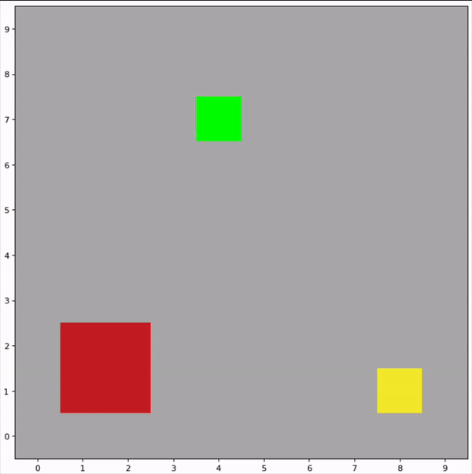

# Grid World Reinforcement Learning

This repository demonstrates two approaches to solving a grid world navigation problem using reinforcement learning algorithms. The agent must learn to navigate through a hazardous environment with fires and cliffs to reach a goal state.



## Environment

The grid world environment consists of:

- **Goal State**: Provides +100 reward
- **Fire Hazards**: Negative reward (-50) but traversable 
- **Cliff Edges**: Terminal state with large negative reward (-100)
- **Movement Cost**: Each step costs -1 to encourage efficient paths
- **Optional Wind**: Can randomly alter agent movement direction

The agent can move in 4 directions (up, down, left, right) and must learn the optimal policy to reach the goal while avoiding hazards.

## Implementations

### 1. Classical Q-Learning (`q_learning.ipynb`)
- Traditional tabular Q-learning approach
- Maintains Q-value table for state-action pairs
- Simple but effective for discrete state spaces
- Epsilon-greedy exploration strategy

### 2. Deep Q-Learning (`deep_q_learning.ipynb`) 
- Uses convolutional neural network to approximate Q-function
- Can process visual state representations
- Implements key DQN improvements:
  - Experience replay buffer
  - Target network
  - Gradient clipping
  - Batch normalization

## Network Architecture

````python
QNetwork(
(conv1): Conv2d(3, 32, kernel_size=3, padding=1)
(pool): MaxPool2d(2, 2)
(conv2): Conv2d(32, 32, kernel_size=3, padding=1)
(batch_norm): BatchNorm2d(32)
(fc1): Linear(800, 64)
(fc2): Linear(64, 4)
)
`````


## Key Features

- Configurable environment parameters:
  - Fire spread probability
  - Wind strength
  - Grid size
  - Starting position (random/fixed)
  
- Training parameters:
  - Learning rate
  - Discount factor
  - Exploration rate (epsilon)
  - Experience buffer size
  - Target network update frequency
